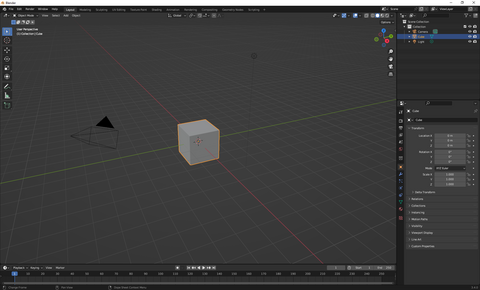

Blender is available for Microsoft Windows, macOS, and Linux. Blender is free to use.

+ Download Blender at [www.blender.org/download](https://www.blender.org/download/){:target="_blank"}
+ Install Blender
+ Open Blender
+ A pop-up will appear in Blender

+ Click outside the pop-up to close it

You are ready to start to use Blender.

