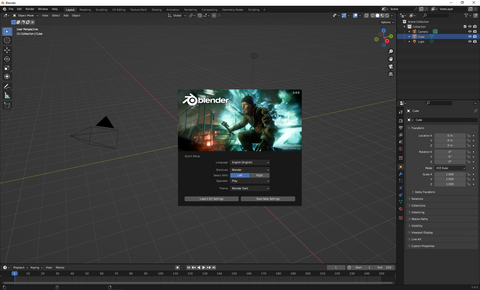

Blender is available for Windows, MacOS and Linux. Blender is free to use. 

+ Download Blender from [Blender](https://www.blender.org/download/){:target="_blank"}.
+ Install Blender.
+ Open Blender. 
+ A pop will appear. 

+ Click outside the popup to close it.

You are ready to begin using Blender. 

